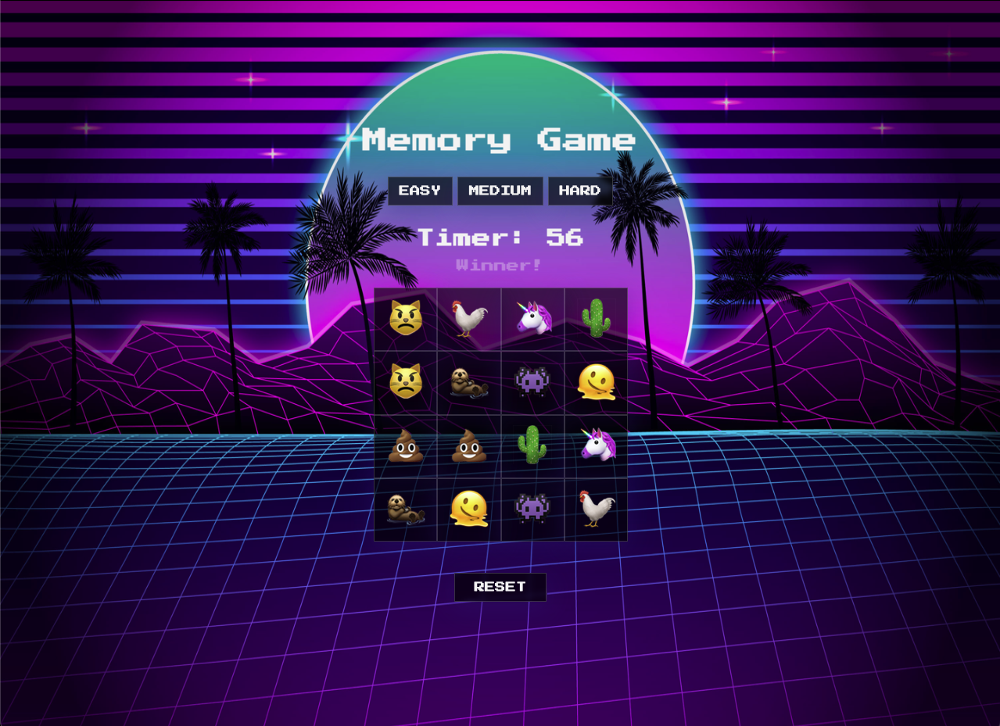

# Memory Game

*Memory Game* is as it sounds. It is a simple memory based game where the aim is to select all matching pairs of emojis. There is no time limit set so the user has as much time as they need to work through the entire 4 x 4 board.

[Memory Game](https://uakaris.github.io/Project-1/)

## How to play

Use the mouse to click on squares within the board to reveal the emojis. Matching pairs of emojis once found will remain on the board. If you click two squares that do not match, they will return to being hidden. The aim is to find all matching pairs of emojis.

The game can be played as many times as possible. Simply click the ***reset*** button once a game is finished to reset the board and start again.

## Built with

* Javascript
* HTML
* CSS

## Features

Audio that is triggered by clicks on squares within the board, 

## Credits

All audio was sourced from [Freesound](https://freesound.org/)

General css animations were used along with animations from [Animate.css](https://animate.style/)

## Next steps 

Things I would like to add to the game in the future: 

* further animations that are triggered when a player wins.
* A timer that counts down from 30 seconds each time a square is clicked allowing only 30 seconds for the player to find a matching pair of emojis.
* A gameOver function that declares the game over if a matching pair of emojis is not found in 30 seconds.

## licence