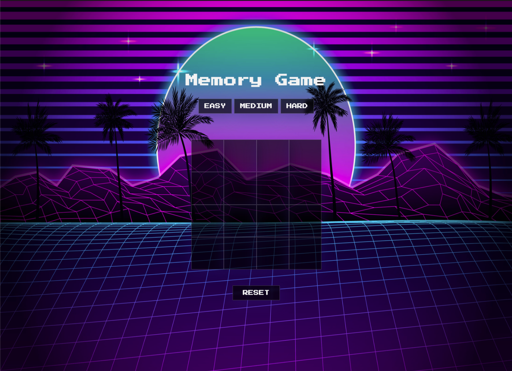

# Memory Game

*Memory Game* is as it sounds. It is a simple memory based game where the aim is to select all matching pairs of emojis. 

Click the below link to play!

[Memory Game](https://uakaris.github.io/Project-1/)

## How to play

Selected a level of difficulty from the three options. Easy allows 90 seconds to complete the game, medium allows 60 seconds, and hard allows 30 seconds.

Use the mouse to click on squares within the board to reveal the emojis. Matching pairs of emojis once found will remain on the board. If you click two squares that do not match, they will return to being hidden. The aim is to find all matching pairs of emojis within the given time.

The game can be played as many times as possible. Simply click the ***reset*** button once a game is finished to reset the board and start again.

## Built with

* Javascript
* HTML
* CSS

## Features

* Interactive audio.
* CSS animations.
* Three levels of difficulty.
* Countdown timer that is set by the three levels of difficulty.

## Credits

All audio was sourced from [Freesound](https://freesound.org/)

General css animations were used along with animations from [Animate.css](https://animate.style/)

Further credit to **Sarma** for his help with finishing my timer function as well as spending a huge amount of time helping to create the 'easy', 'medium', and 'hard timer settings. To **CJ** for assisting with the ***checkForWinner*** function and with early issues with the ***reset*** function. The assistance was greatly appreciated.

## Next steps 

Things I would like to add to the game in the future: 

* Further animations that are triggered when a player wins, or loses.
* Updating the ***timer*** function so it resets after a pair is found rather than having a timer that runs for the whole game. This would make the game more exciting.
* Adding animation to 'flip' the squares when the emojis are revealed.
* more advanced CSS styling.